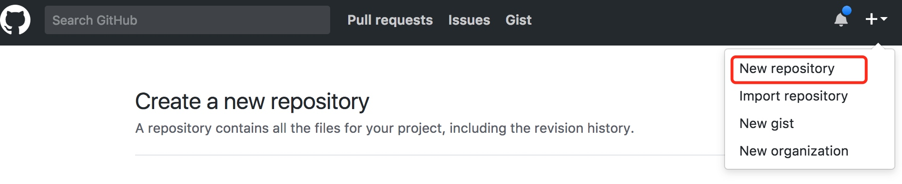
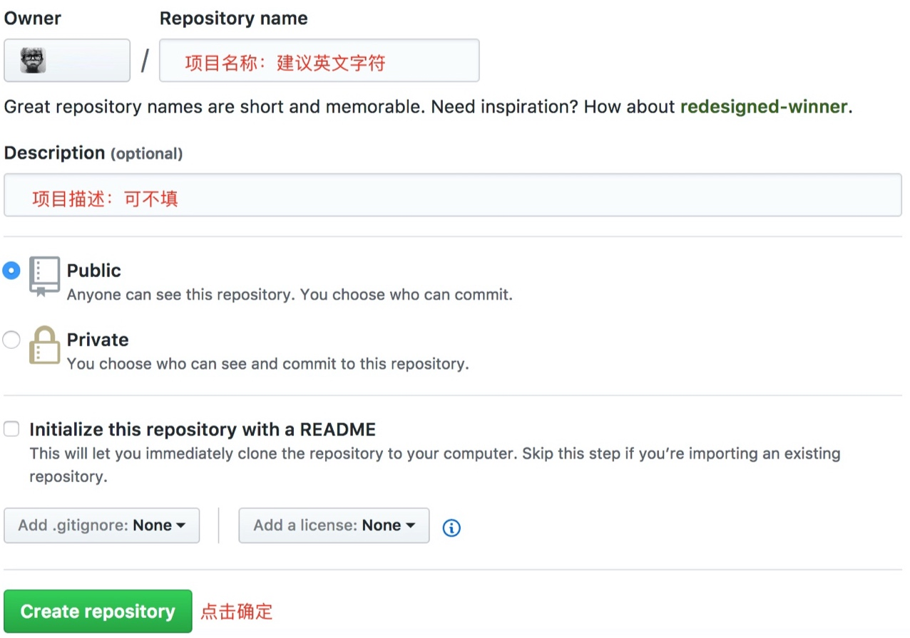

# Git 创建版本库 - 连接配置

本项目产生于梳理自身知识架构体系，致力于逐渐整理 Git 的知识点，不断加深记忆，深入学习探索，方便工作中查阅，也希望能够对其他朋友有一定帮助。

首先感谢 [廖雪峰](http://www.liaoxuefeng.com/wiki/0013739516305929606dd18361248578c67b8067c8c017b000) ，其所作的 Git 的教程细致深入，通俗易懂，让我更合理的深入整理了一遍 Git 的知识体系，如果你是零基础初学者，可以直接跳过本文，直接去学习这篇教程，以节省时间，如果你有一定基础，需要不断更新整理，欢迎继续阅读，希望你能在此处找到你想要的答案


## 创建版本库

首先在全局安装 `git` ，然后在目标路径建立一个空目录，以用作创建 `git` 仓库：

```
mkdir learngit  # 目录名称 | 创建
   cd learngit  # 目录地址 | 进入
```
然后在新创建的目录中，通过 `git init` 命令，把该目录变成一个 `git` 可以管理的仓库，成功后当前目录下会添加一个 `.git` 隐藏目录，可以使用命令查看：

```
ls -ah
```
这个目录是 `git` 跟踪管理版本库的，所以理论上千万不要手动修改这个目录中的文件，以免出现毁灭性错误


## 远程仓库连接配置

##### 第一步：创建 SSH Key

在用户主目录下，看看是否存在 `.ssh` 目录，在查看该目录下是否存在 `id_rsa` 、`id_rsa.pub` 这两个文件，无则创建，有则<a href='#GitHubCoding'>跳过</a>：

```
cd ~    # 返回主目录
ls -ah  # 查看隐藏文件
```
创建 **SSH Key**：

```vim
ssh-keygen -t rsa -C 'Dreamslink@qq.com'
```
需要把邮件地址换成你自己的邮件地址，然后一路回车，使用默认值即可，无需设置密码，如果一切顺利，可以在用户主目录中找到 `.ssh` 目录，里面有 `id_rsa` 、`id_rsa.pub` 两个文件，这两个就是 **SSH Key** 的密钥对:

* `id_rsa` : 是私钥，不能泄露出去
* `id_rsa.pub` : 是公钥，可以放心的告诉任何人


##### 第二步：登录 GitHub 添加
<a id='GitHubCoding'></a>

登录 `GitHub` 远程库，找到添加 **SSH Key** 的页面，然后将 `id_rsa.pub` 中的公钥添加其中，即可。

> **为什么远程库需要**SSH Key**呢？**
> 
> 那是因为远程库需要识别出你推送的提交确实是你推送的，而不是别人冒充的，而 Git 支持 SSH 协议，所以，远程库只要知道你的公钥，就可以确认只有你自己才能推送。
> 
> 远程库允许你添加多个 Key，假定你有多台电脑，一会儿再家提交，一会儿再公司提交，只要把每台电脑的 Key 都添加到远程库中，就可以多设备推送。
> 

##### 第三步：连接远程库

先撇开 `Coding` 不谈，假设只使用 GitHub 库，设置好 **SSH Key** ，现在你已经在本地创建了一个 Git 仓库，又想在 GitHub 创建一个仓库，并且实现两个仓库的远程同步，从而达到**远程备份**，以及与他人**协作开发**的目的。

<b style="color:#ccc;font-size:12px">GitHub为2017年布局</b>
首先登陆 GitHub ，找到 **New repository** 选项点击：



而后输入项目名称为：**learngit** ，其他保持默认设置，点击确认，就成功的创建了一个新的 Git 仓库



新建立的 Git 仓库是空的，可通过设置与之本地仓库关联，如本地仓库没有内容,可新建一个 commit用于首次提交：

```vim
echo "# learngit" >> README.md
git add README.md
git commit -m "first commit"
git remote add origin git@github.com:zlccn/learngit.git
```

如本地仓库以有内容，可直接关联到远程库：

```vim
git remote add origin git@github.com:zlccn/learngit.git
```
注意，把上面 zlccn 替换成自己的 GitHub 用户名，否则，你在本地关联的就是我的远程库，会直接导致推送不成功，因为你的 **SSH Key** 公钥不在我的账户列表中。

```cmd
git push -u origin master
```
把本地库的内容推送到远程，用 `git push` 命令，实际上是把当前分支 master 推送到远程，由于远程库是空的，我们第一次推送 master 分支时，加上了 `-u` 参数，Git 不但会把本地的 master 分支内容推送的远程新的 master 分支，还会把本地的 master 分支和远程的 master 分支关联起来，在以后的推送或者拉取时就可以简化命令。

> 由于个人使用环境，以及基础设置问题，首次推送会出现些许情况，例如：

> **SSH 警告**：这是因为 SSH 首次链接 GitHub 校验 Key 时，需要你确认GitHub 的 Key 的指纹信息是否真的来自 GitHub 的服务器，回车即可；

> **账户密码校验**: 这是因为有些远程库需要校验，可直接输入相关远程的用户名及密码即可，该问题仅仅出现在首次，之后不需校验
> 
> 其实还可能出现其他问题，这里不再概述


