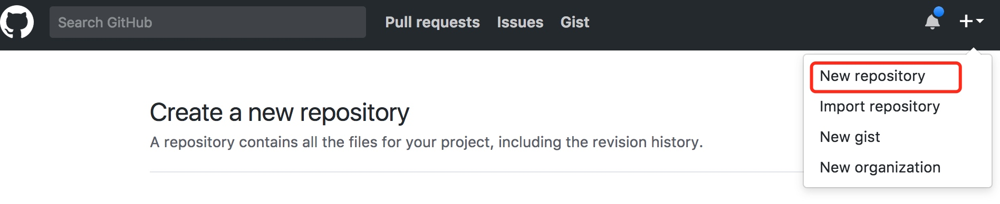
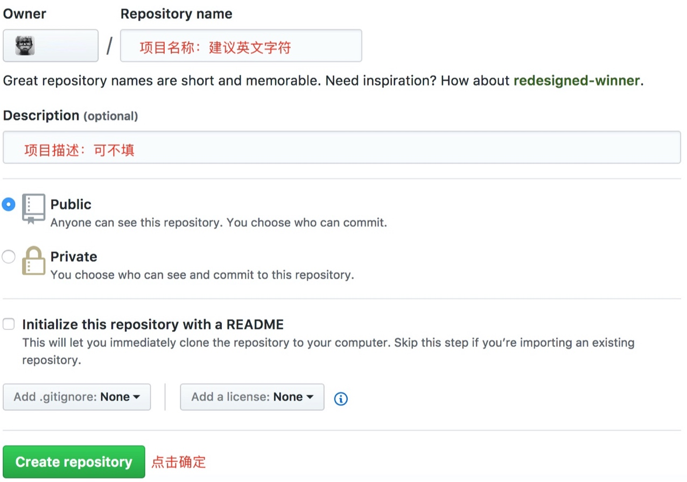

# Git 环境配置

本项目产生于梳理自身知识架构体系，致力于逐渐整理 Git 的知识点，不断加深记忆，深入学习探索，方便工作中查阅，也希望能够对其他朋友有一定帮助。

首先感谢 [廖雪峰](http://www.liaoxuefeng.com/wiki/0013739516305929606dd18361248578c67b8067c8c017b000) ，其所作的 Git 的教程细致深入，通俗易懂，让我更合理的深入整理了一遍 Git 的知识体系，如果你是零基础初学者，可以直接跳过本文，直接去学习这篇教程，以节省时间，如果你有一定基础，需要不断更新整理，欢迎继续阅读，希望你能在此处找到你想要的答案


## 创建版本库

首先在全局安装 `git` ，然后在目标路径建立一个空目录，以用作创建 `git` 仓库：

```
mkdir learngit  # 目录名称 | 创建
   cd learngit  # 目录地址 | 进入
```
然后在新创建的目录中，通过 `git init` 命令，把该目录变成一个 `git` 可以管理的仓库，成功后当前目录下会添加一个 `.git` 隐藏目录，可以使用命令查看：

```
ls -ah
```
这个目录是 `git` 跟踪管理版本库的，所以理论上千万不要手动修改这个目录中的文件，以免出现毁灭性错误


## 远程仓库连接配置

##### 第一步：创建 SSH Key

在用户主目录下，看看是否存在 `.ssh` 目录，在查看该目录下是否存在 `id_rsa` 、`id_rsa.pub` 这两个文件，无则创建，有则<a href='#GitHubCoding'>跳过</a>：

```
cd ~    # 返回主目录
ls -ah  # 查看隐藏文件
```
创建 **SSH Key**：

```vim
ssh-keygen -t rsa -C 'Dreamslink@qq.com'
```
需要把邮件地址换成你自己的邮件地址，然后一路回车，使用默认值即可，无需设置密码，如果一切顺利，可以在用户主目录中找到 `.ssh` 目录，里面有 `id_rsa` 、`id_rsa.pub` 两个文件，这两个就是 **SSH Key** 的密钥对:

* `id_rsa` : 是私钥，不能泄露出去
* `id_rsa.pub` : 是公钥，可以放心的告诉任何人


##### 第二步：登录 GitHub 添加
<a id='GitHubCoding'></a>

登录 `GitHub` 远程库，找到添加 **SSH Key** 的页面，然后将 `id_rsa.pub` 中的公钥添加其中，即可。

> **为什么远程库需要**SSH Key**呢？**
>
> 那是因为远程库需要识别出你推送的提交确实是你推送的，而不是别人冒充的，而 Git 支持 SSH 协议，所以，远程库只要知道你的公钥，就可以确认只有你自己才能推送。
>
> 远程库允许你添加多个 Key，假定你有多台电脑，一会儿再家提交，一会儿再公司提交，只要把每台电脑的 Key 都添加到远程库中，就可以多设备推送。
>

##### 第三步：连接远程库

先撇开 `Coding` 不谈，假设只使用 GitHub 库，设置好 **SSH Key** ，现在你已经在本地创建了一个 Git 仓库，又想在 GitHub 创建一个仓库，并且实现两个仓库的远程同步，从而达到**远程备份**，以及与他人**协作开发**的目的。

<b style="color:#ccc;font-size:12px">GitHub为2017年布局</b>
首先登陆 GitHub ，找到 **New repository** 选项点击：



而后输入项目名称为：**learngit** ，其他保持默认设置，点击确认，就成功的创建了一个新的 Git 仓库



新建立的 Git 仓库是空的，可通过设置与之本地仓库关联，如本地仓库没有内容,可新建一个 commit用于首次提交：

```vim
echo "# learngit" >> README.md
git add README.md
git commit -m "first commit"
git remote add origin git@github.com:zlccn/learngit.git
```

如本地仓库以有内容，可直接关联到远程库：

```vim
git remote add origin git@github.com:zlccn/learngit.git
```
注意，把上面 zlccn 替换成自己的 GitHub 用户名，否则，你在本地关联的就是我的远程库，会直接导致推送不成功，因为你的 **SSH Key** 公钥不在我的账户列表中。

```cmd
git push -u origin master
```
把本地库的内容推送到远程，用 `git push` 命令，实际上是把当前分支 master 推送到远程，由于远程库是空的，我们第一次推送 master 分支时，加上了 `-u` 参数，Git 不但会把本地的 master 分支内容推送的远程新的 master 分支，还会把本地的 master 分支和远程的 master 分支关联起来，在以后的推送或者拉取时就可以简化命令。

> 由于个人使用环境，以及基础设置问题，首次推送会出现些许情况，例如：

> **SSH 警告**：这是因为 SSH 首次链接 GitHub 校验 Key 时，需要你确认GitHub 的 Key 的指纹信息是否真的来自 GitHub 的服务器，回车即可；

> **账户密码校验**: 这是因为有些远程库需要校验，可直接输入相关远程的用户名及密码即可，该问题仅仅出现在首次，之后不需校验
>
> 其实还可能出现其他问题，这里不再概述


##### 多 Git 仓库搭建连接

实际工作中，你的项目不一定想让非开发人员参与，这时你就需要把你的项目私有化，虽然 <a href='https://github.com/'>GitHub</a> 是世界上最大的 Git 免费托管库，但其能让大多数人使用的都是公有库，你所上传的内容，任何人都能看见，虽然它也有私有库，却要收费，所以在你不是土豪，没有条件自己搭建托管服务器，而又想建立私有库的情况下，推荐使用 <a href='https://coding.net'>Coding</a> ,它是一个面向开发者的云端开发平台，具体好处自己问度娘，这里只说一点：**支持私有，而且免费** ，我个人觉得，所有炫酷功能和这一点比都是浮云，不是吗？

那么问题来了，如何同时在本地连接多个远程库，而又易于管理？

需要解决几个问题：

##### 如何配置多个 **SSH Key** ？

由于每个远程库都需要使用 Key 验证，而如果每次都覆盖了原来的 `id_rsa` ，那么之前的认证就会失效，这时就需要我们针对不同的远程库配置其专属的 SSH Key。

那么我们就面临一个重要问题，==**多用户权限**==，例：

前面我们已经连接 `github` 这个远程库，并生成密钥对(`id_rsa`、`id_rsa.pub`)，其公钥保存在了 `github` 里，每次连接时 `SSH` 客户端发送本地私钥，到服务端验证，连接服务器上保存的公钥，在这种单用户情况下，发送的私钥和公钥是配对的；

但当继续连接 `coding` 这个远程库时，就需要重新生成密钥对，这就会覆盖掉 `github` 所生成的密钥对，继而导致 `github` 的验证失败；那么我们就需要创建针对于不同远程库的独立密钥对，让其互不干扰，才能有效解决问题，

以 `github` 和 `coding` 为例：，生成新的自定义名称的公钥：

```vim
ssh-keygen -t rsa -C "you_email" -f ~/.ssh/github_isa
ssh-keygen -t rsa -C "you_email" -f ~/.ssh/coding_isa
```
执行完成后，会在 `~/.ssh/` 目录下生成 `github_isa` 、 `github_isa.pub` 、`coding_isa` 、 `coding_isa.pub` 文件；然后查看系统 `ssh-key` 代理,执行如下命令：

```
ssh-add -l
```

如果输出得到  `The agent has no identities.` 则表示没有代理。如果系统有代理，可以执行下面的命令清除代理:

```
ssh-add -D
```

然后依次将不同的ssh添加代理，执行命令如下：

```
ssh-add ~/.ssh/github_isa
ssh-add ~/.ssh/coding_isa
```

如果报错，则需要先运行一下 `ssh-agent bash` 命令后再执行 `ssh-add` 命令，完成之后，我们需要配置 `~/.ssh/config` 文件，这个文件是用于配置私钥对应的服务器，如果没有就在 `~/.ssh/` 目录下创建：

```vim
# Github
Host github.com
HostName github.com
User git
IdentityFile ~/.ssh/github_rsa


# Coding
Host git.coding.net
Hostname git-ssh.coding.net
Port 443
User git
IdentityFile ~/.ssh/coding_rsa
```

可以看到这些配置大多相同，有两点需要重点说明：

`IdentityFile` :

配置对应的私钥地址，`~/.ssh/...` 就是路径

`Port` :

端口修改，当你配置两个以上的远程库时，很可能出现端口被占用，这个时候就需要修改其中某一个远程库连接时所使用的端口，可以看到 `Coding` 中存在 `Port:443` ，这个端口是官方推荐的，配置成其他的也行，但建议使用官方推荐；

当全部设置完后，`:wq` 保存退出，到这里，**SSH Key** 就配置完了，可以检测配置文件是否正常工作：

```vim
ssh -T git@github.com
ssh -T git.coding.net
```

如果，正常的话，会出现如下提示：

```
Hi zlccn! You've successfully authenticated, but github does not provide shell access.
```
完成后，依照本文方法将 `coding_rsa.pub` 、 `github_rsa.pub` 公钥添加在相应的远程库里即可。

##### 如何一次向多个远程库推送？

重温一下 `git` 仓库的设置，在指定项目中执行一下操作 ：

```
git init

echo "# learngit" >> README.md
git add README.md
git commit -m "first commit"

git remote add origin git@github.com:zlccn/learngit.git   
# 如果只想连接 Github 远程库

git remote add origin git@git.coding.net:zlccn/learngit.git
# 如果只想连接 Coding 远程库

git push -u origin master
```

从上文可以了解，在一个项目中不管你是想连接 `Github` 还是 `Coding` 都没有问题，也不需要从新在配置 **SSH Key** ，但是，当你出于安全或者宣传考虑，想一次 `push` 把项目部署到多个 `git` 远程库之中时，这方法就玩不转了。

有朋友就说了，我依照上述方法，同时 `remote` 两次不就行了吗？

俩字儿，**不通**；

因为，当你第二次执行 `remote` 时，会把前一次的添加覆盖掉，只会剩下一个；

好吧，既然这种方法搞不定，就来一个笨方法，**手动添加**；

在初始化 `git` 之后，当前文件夹下会建立一个 `.git` 隐藏文件，这就是本地的 `git` 仓库，在这个文件夹中有一个 `config` 文件 ：

```cmd
cd .git/
ls -ah
vim config
```

进入编辑状态后，我们可以看见其中的一些基础配置：

```
[core]
        repositoryformatversion = 0
        filemode = true
        bare = false
        logallrefupdates = true
        ignorecase = true
        precomposeunicode = true
[remote "origin"]
        url = git@git.coding.net:zlccn/learngit.git
        ...
```

上面的配置不做解释，有兴趣的朋友可以自行 Google，这里只说如何实现，可以看见 `remote` 项目中有一个 `url` ，这就是我们添加的远程库访问方式，这时 `url` 只有一条，我们只需要相对应的把 `Github` 的访问方式添加进来：

```
[remote "origin"]
        url = git@git.coding.net:zlccn/learngit.git
        url = git@github.com:zlccn/learngit.git
```

修改完成后，`:wq` 保存，至此就实现了一次操作，同时推送到多个平台的功能。当你使用 `push` 操作时，git 就会根据你设置的 `url` 顺序，向平台推送代码。
